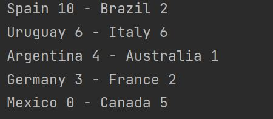

# SportRadar_WorldCup_Tournament
Steps to run the project:
1. git clone and checkout the project from master branch
2. perform maven clean install (mvn clean install).
3. A dummy data set of football data feed is placed under resources.
4. Navigate to Starter.java and execute the main method.
5. Add a new Data in the feedData.json file to test.

Assumptions:
1. A live data feed is imitated in resources/feedData.json
2. The feed send Game Data.
3. Goal will be incremented by 1 unit only irrespective of any value received more than 1.
4. Game having a valid score will be considered for computation -ve/null goals feeds are rejected.
5. The sorting is based on
     a) No. of valid goals secured in a Game. If a negative/null data received is the most recent entry it will be ignored.
     b) The latest Game received by the team. In case of matching goal counts, match having the latest goal secured will be placed above.
6. Based on the sorting as mentioned in step4. output should be

